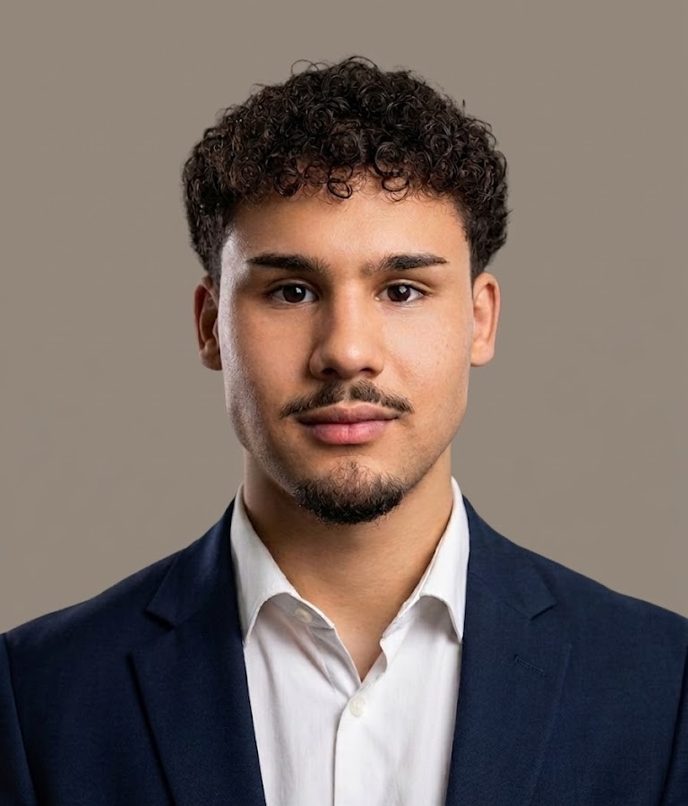

  

<h1 align="center">Angelo Diaz</h1>

  <strong>Software Engineering Student at Florida Gulf Coast University</strong> 
  C++ • Linux • Backend Systems • Quantitative Development

  <a href="https://www.linkedin.com/in/angelodiazz">LinkedIn</a>
  ·
  <a href="mailto:angelodiazm10@gmail.com">Email</a>

---

## About Me

I am a Software Engineering student at Florida Gulf Coast University, expecting to complete my B.S. in May 2028.

I was admitted to FGCU's Combined B.S. in Software Engineering/M.S. in Computer Science Program and plan to pursue a Data Science concentration. I was named to the Dean's List for Spring 2026.

My primary career interest is quantitative development, with backend infrastructure, systems software, C++, data engineering, and related software-engineering roles as additional targets.

I am preparing for Summer 2027 internships.

## Current Focus

- Developing C++20 and Linux skills through Hydra-Quant
- Studying data structures and algorithms
- Building experience with Git, GitHub, GNU Make, CMake, and Linux development
- Improving project testing, documentation, and reproducibility
- Preparing for software-engineering and quantitative-development interviews

## Featured Projects

### [Hydra-Quant](https://github.com/angelodiazz/hydra-quant) — In Progress

An in-development C++20 and Linux systems-engineering project intended to grow into a deterministic market-data replay and simulated-execution platform.

Current work includes:

- Ubuntu virtual-machine and SSH development environment
- C++20 GNU Make build
- Git and GitHub repository workflow
- Isolated Git worktrees for controlled development and review
- Architecture, roadmap, decision, status, and development documentation

Market-data ingestion, deterministic replay, risk controls, execution simulation, automated testing, concurrency, and performance benchmarking remain planned work.

### [Payroll Management System](https://github.com/angelodiazz/payroll-management-system)

A C++17 payroll application with a shared backend used by a Qt 6 graphical interface and a console interface.

Implemented concepts include:

- Abstract classes and runtime polymorphism
- Hourly and salaried employee models
- Templates and lambda expressions
- Input validation and exception handling
- CMake-based builds

### [Student Record System](https://github.com/angelodiazz/student-record-system)

A C++17 command-line application for managing student records.

Implemented features include:

- Create, read, update, and delete operations
- ID and last-name searches
- CSV persistence
- Input validation
- Filesystem-based storage

### [Soccer Stats Tracker](https://github.com/angelodiazz/soccer-stats-tracker)

A C++17 command-line application for recording and analyzing soccer player statistics.

Implemented features include:

- Player and match-stat management
- CSV import and export
- Goals, assists, and minutes-per-match calculations
- Player and team summaries

### [GPA Calculator](https://github.com/angelodiazz/gpa-calculator)

A C++17 command-line application that calculates weighted and unweighted GPA values.

Implemented features include:

- Letter-grade normalization
- Credit-weighted GPA calculations
- Configurable course weighting
- Input validation
- CSV import and export

## Technical Skills

| Category | Technologies |
|---|---|
| Languages | C++17, C++20, Python |
| Libraries and Frameworks | Standard Template Library, Qt 6 |
| Systems and Build Tools | Linux, GNU Make, CMake, GCC |
| Development Tools | Git, GitHub, CLion, VS Code, Cursor |
| Core Knowledge | Data Structures and Algorithms, Object-Oriented Programming, File I/O |

## Algorithm Practice

My data-structures and algorithms work is available in the [NeetCode Submissions](https://github.com/angelodiazz/neetcode-submissions) repository.

## Education

**Florida Gulf Coast University**

- B.S. in Software Engineering, expected May 2028
- Admitted to the Combined B.S./M.S. Program in Computer Science
- Planned Data Science concentration
- Dean's List — Spring 2026

## Contact

- LinkedIn: [linkedin.com/in/angelodiazz](https://www.linkedin.com/in/angelodiazz)
- Email: [angelodiazm10@gmail.com](mailto:angelodiazm10@gmail.com)
- Location: Naples, Florida
