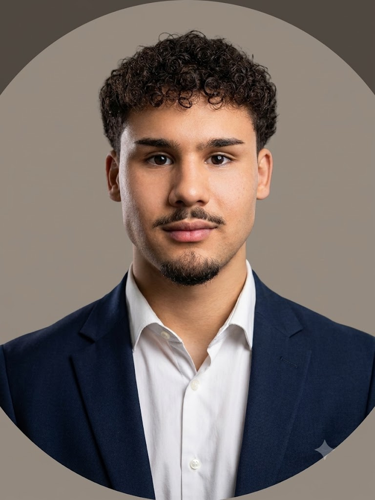

  

<h1 align="center">Angelo Diaz</h1>

  <strong>Software Engineering @ Florida Gulf Coast University (Class of 2028)</strong> 
  Software Engineer | Focused on Low-Latency Systems, Custom Memory Management, & Secure Architectures

  
  

---

## 🚀 Professional Summary

I am a Software Engineering student at FGCU specializing in low-latency systems development, custom memory management, and deterministic performance. My technical focus centers on bypassing high-overhead runtime operations, exploiting hardware cache structures, and implementing secure, robust data pipelines.

---

## 💻 Technical Stack
| Category | Technologies |
| :--- | :--- |
| **Languages** | C++17 (Core), Python |
| **Frameworks** | Qt 6 (GUI Development), STL |
| **Build Systems** | CMake (Manual Configuration), Make |
| **Tools** | Linux VM Shell, GCC/Clang, Valgrind, GDB, Git, Cursor, VS Code, CLion |

---

## NeetCode Solutions

### [NeetCode Submissions](https://github.com/angelodiazz/neetcode-submissions)

---

## 📂 Featured Technical Projects

### [Hydra-Quant Platform](https://github.com/angelodiazz/hydra-quant) *(In Progress)*
* **Project Goal:** Architect a complete, microsecond-latency algorithmic execution platform from scratch in C++. The objective is to achieve optimal execution speed and deterministic latency through strict hardware optimization, custom allocation strategies (RAII memory pools), lock-free sequential data structures, and multi-threaded inter-process communication (IPC)—completely bypassing standard runtime heap allocations and operating system interrupts.

### [Payroll Management System](https://github.com/angelodiazz/payroll-management-system)
* **Dual-Head Architecture:** Architected a modular engine where a single C++ backend powers both a **Qt 6 GUI** and a **Console CLI** without code duplication.
* **Polymorphic Logic:** Designed a scalable class hierarchy utilizing **pure virtual functions** and multiple inheritance to enforce contract compliance across employee types.
* **Functional Integration:** Implemented generic `total<Func>` templates using **Lambda expressions** for dynamic runtime aggregations.

### [Soccer Stats Tracker](https://github.com/angelodiazz/soccer-stats-tracker)
* **Custom Serialization:** Engineered a manual CSV parser with **quoted-string escaping** and literal double-quote handling to ensure data integrity without external libraries.
* **Analytics Engine:** Utilized **STL Containers** and floating-point arithmetic to compute real-time match metrics and team-level aggregation.
* **Defensive Design:** Leveraged **const-correctness** and `std::move` semantics to ensure memory safety and efficient string handling.

---

## 📈 Growth Roadmap
* **Data Structures:** Implementing fundamental structures (Linked Lists, Trees, Graphs) as part of my Spring '26 DSA curriculum.
* **Computer Security:** Actively applying security principles to C++ development, focusing on **input sanitization**, **buffer overflow mitigation**, and **secure memory management**.
* **Open Source:** Identifying C++ based projects (Qt/System tools) to contribute to professional-grade codebases.
* **Systems Architecture (Summer 2026):** Designing multi-threaded concurrency models, memory arena allocators, and local domain socket inter-process communication (IPC) for backend integrations.
* **Algorithmic Mastery:** Resolving and cataloging fundamental and advanced structures, with an emphasis on replacing dynamic heap sequences with stack-allocated sequential elements.
* **Academic Preparation (Fall 2026):** Building preliminary foundations for upcoming Operating Systems and Systems-Level coursework by studying boundary defense, thread scheduling, and kernel interfaces.

---

## 📫 Connect with Me
- **LinkedIn:** [linkedin.com/in/angelodiazz](https://www.linkedin.com/in/angelodiazz)
- **Email:** angelodiazm10@gmail.com
- **Location:** Naples, FL
